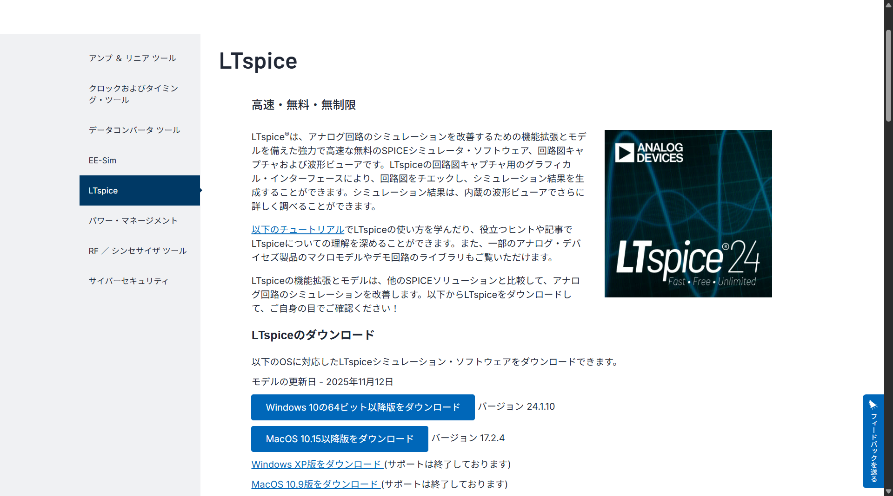
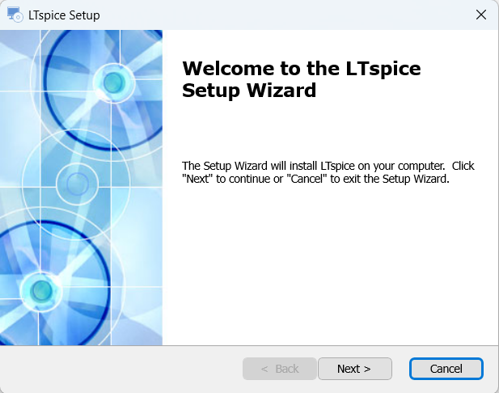
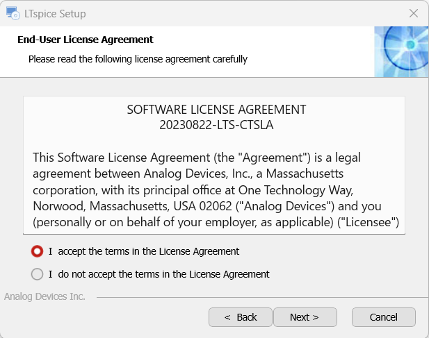
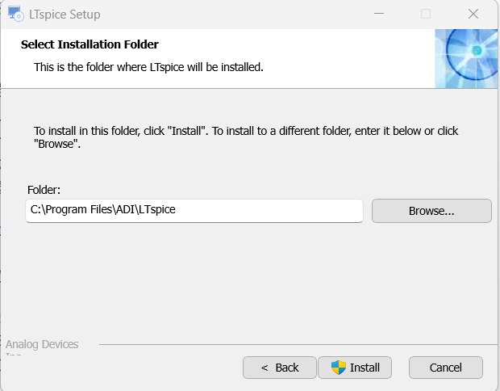
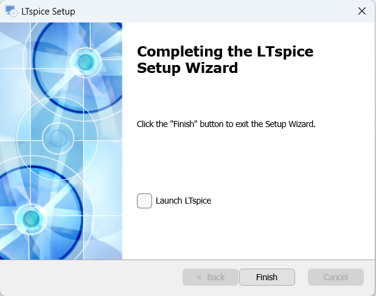
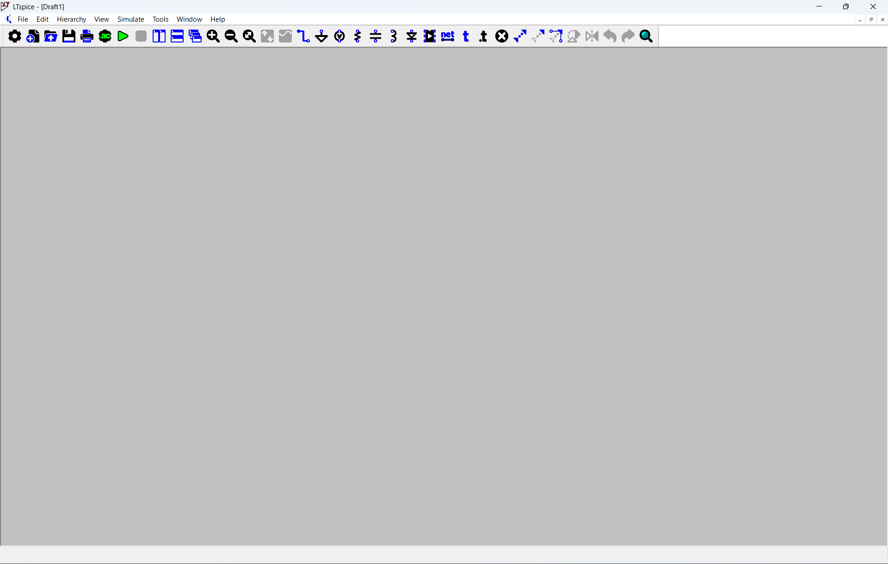

# LTspice インストールガイド

**作成日**: 2025-11-11
**対象**: 電子回路シミュレーション初心者・学生
**最終更新**: 2025-11-13

---

## 📋 目次

1. [LTspiceとは](#ltspiceとは)
2. [システム要件](#システム要件)
3. [ダウンロード手順](#ダウンロード手順)
4. [インストール手順（Windows）](#インストール手順windows)
5. [初回起動と動作確認](#初回起動と動作確認)
6. [日本語マニュアルのダウンロード](#日本語マニュアルのダウンロード)
7. [トラブルシューティング](#トラブルシューティング)

---

## LTspiceとは

### 概要

**LTspice®** は、Analog Devices社（旧Linear Technology社）が提供する**完全無料**の回路シミュレーションソフトウェアです。

### 特徴

✅ **完全無料**
- ライセンス料不要
- 機能制限なし
- 商用利用も可能

✅ **高性能**
- 高速SPICEシミュレーションエンジン
- 大規模回路にも対応
- 詳細な波形解析

✅ **豊富な機能**
- 回路図エディタ内蔵
- 波形ビューア内蔵
- 膨大な部品ライブラリ
- カスタムモデル追加可能

✅ **学習に最適**
- 直感的な操作
- 豊富なサンプル回路
- 詳細な日本語マニュアル

### 主な用途

- アナログ回路のシミュレーション
- スイッチング電源の設計検証
- フィルタ回路の周波数特性解析
- オペアンプ回路の動作確認
- 学生の電子回路学習

---

## システム要件

### Windows版

**最新版**: LTspice Version 24.1.10（2025年11月時点）

| 項目 | 要件 |
|------|------|
| **OS** | Windows 10 64-bit 以降 / Windows 11 |
| **プロセッサ** | x64プロセッサ |
| **メモリ** | 4GB以上推奨（最小2GB） |
| **ディスク容量** | 500MB以上の空き容量 |
| **ディスプレイ** | 1280×720以上推奨 |

---

## ダウンロード手順

### 1. 公式サイトにアクセス

**Analog Devices 公式ダウンロードページ:**

```
https://www.analog.com/jp/resources/design-tools-and-calculators/ltspice-simulator.html
```

### 2. ダウンロードページの構成



**図: Analog Devices LTspiceダウンロードページ**

ページには以下の情報が表示されています：

- LTspiceの紹介文
- 最新バージョン情報
- Windows版とMacOS版のダウンロードボタン
- 日付: モデルの更新日（例: 2025年11月12日）

### 3. Windows版をダウンロード

**「Windows 10/64ビット版をダウンロード」** ボタンをクリック

```
ファイル名: LTspice64.msi
サイズ: 約50MB
バージョン: 24.1.10
```

💡 **NOTE**: 以前のバージョンでは `.exe` 形式でしたが、現在は `.msi` 形式のインストーラーが配布されています

💡 **TIPS**: ダウンロードには数分かかる場合があります

⚠️ **注意**:
- 必ず公式サイトからダウンロードしてください
- 非公式サイトからのダウンロードは避けてください

---

## インストール手順（Windows）

### ステップ1: インストーラーの起動

ダウンロードした `LTspice64.msi` をダブルクリックして実行します。

**ユーザーアカウント制御（UAC）**が表示された場合は **"はい"** をクリックしてください。

### ステップ2: セットアップウィザードの開始



**図: LTspice Setup Wizard 開始画面**

**「Welcome to the LTspice Setup Wizard」**画面が表示されます。

```
The Setup Wizard will install LTspice on your computer. Click
"Next" to continue or "Cancel" to exit the Setup Wizard.
```

**"Next >"** ボタンをクリック

### ステップ3: ライセンス契約への同意



**図: End-User License Agreement 画面**

**「End-User License Agreement」**が表示されます。

```
SOFTWARE LICENSE AGREEMENT
20230822-LTS-CTSLA

This Software License Agreement (the "Agreement") is a legal
agreement between Analog Devices, Inc., a Massachusetts
corporation having its principal office at One Technology Way,
Norwood, Massachusetts, USA 02062 ("Analog Devices") and you
(personally or on behalf of your employer, as applicable) ("Licensee")
```

**ラジオボタンで「I accept the terms in the License Agreement」を選択**

**"Next >"** ボタンをクリック

⚠️ **注意**: ライセンスに同意しないとインストールできません

### ステップ4: インストール先の選択



**図: Select Installation Folder 画面**

**「Select Installation Folder」**が表示されます。

```
This is the folder where LTspice will be installed.

To install in this folder, click "Install". To install to a different folder, enter it below or click
"Browse".

Folder:
C:\Program Files\ADI\LTspice
```

デフォルトのインストール先:
```
C:\Program Files\ADI\LTspice
```

💡 **TIPS**:
- 特別な理由がない限り、デフォルトのままで問題ありません
- 変更する場合は **"Browse..."** ボタンで別のフォルダを選択できます

**"Install"** ボタンをクリック

### ステップ5: インストールの実行

インストールが開始されます。

💡 **所要時間**: 通常30秒〜1分程度

### ステップ6: インストール完了



**図: Completing the LTspice Setup Wizard 画面**

**「Completing the LTspice Setup Wizard」**が表示されます。

```
Click the "Finish" button to exit the Setup Wizard.

□ Launch LTspice
```

**オプション:**
- □ **Launch LTspice** にチェックを入れると、インストール完了後すぐにLTspiceが起動します

**"Finish"** ボタンをクリック

✅ **インストール完了！**

---

## 初回起動と動作確認

### 1. LTspiceの起動

**方法1: デスクトップショートカットから**
- デスクトップの **LTspice** アイコンをダブルクリック

**方法2: スタートメニューから**
1. スタートメニューを開く
2. **"LTspice"** を検索
3. **LTspice** をクリック

### 2. LTspiceメイン画面の確認



**図: LTspice起動画面（Draft1）**

LTspiceが正常に起動すると、以下の画面が表示されます：

**ウィンドウタイトル:**
```
LTspice - [Draft1]
```

**メニューバー:**
- File, Edit, Hierarchy, View, Simulate, Tools, Window, Help

**ツールバー:**
- 各種作図・シミュレーションツールのアイコン

**ワークスペース:**
- グレーの背景（グリッド表示）
- ここに回路図を作成します

**ステータスバー:**
- 左下に「Ready」と表示
- 右下に「Alternate」と表示

✅ **動作確認ポイント:**
- [ ] LTspiceが起動する
- [ ] メニューバーが表示される
- [ ] ツールバーが表示される
- [ ] ワークスペースが表示される

### 3. サンプル回路を開いて動作確認

**手順:**

1. メニューバー **File → Open** をクリック
2. LTspiceのインストールフォルダに移動
   ```
   C:\Program Files\ADI\LTspice\examples\Educational\
   ```
3. 任意のサンプル回路（例: `RC.asc`）を開く
4. メニューバー **Simulate → Run** をクリック（または **F9キー**）
5. 波形ビューアが開き、シミュレーション結果が表示される

✅ **確認項目:**
- [ ] サンプル回路が開ける
- [ ] シミュレーションが実行できる
- [ ] 波形が表示される

これらが確認できれば、インストールは成功です！

---

## 日本語マニュアルのダウンロード

### 公式日本語マニュアル

Analog Devices社が提供する公式の日本語マニュアルがあります。

**ダウンロード先:**

```
https://www.analog.com/jp/resources/design-tools-and-calculators/ltspice-simulator.html
```

日本語ページから以下のマニュアルをダウンロードできます：

1. **LTspice XVIIヘルプ（日本語）**
   - LTspiceの基本的な使い方
   - 各種機能の詳細説明

2. **SPICEモデルライブラリ**
   - 各種デバイスのSPICEモデル
   - シンボルライブラリ

### マニュアルの配置場所

ダウンロードしたマニュアルは、以下の場所に配置すると便利です：

```
マイドキュメント\LTspice\
または
デスクトップ\LTspice_Manual\
```

---

## トラブルシューティング

### 問題1: インストーラーが起動しない

**症状:** `LTspice64.exe` をダブルクリックしても何も起こらない

**対処法:**

#### 1-1. ダウンロードファイルの確認

- ファイルサイズが約50MBあるか確認
- ダウンロードが途中で切れていないか確認
- 破損している場合は再ダウンロード

#### 1-2. 管理者権限で実行

1. `LTspice64.exe` を右クリック
2. **"管理者として実行"** を選択
3. UACダイアログで **"はい"** をクリック

#### 1-3. セキュリティソフトの確認

- ウイルス対策ソフトがブロックしていないか確認
- Windows Defenderの除外設定を確認
- 必要に応じて一時的にセキュリティソフトを無効化

#### 1-4. SmartScreenの警告

Windows SmartScreenの警告が出た場合:

1. **"詳細情報"** をクリック
2. **"実行"** ボタンをクリック

### 問題2: LTspiceが起動しない

**症状:** インストール後、LTspiceが起動しない、またはすぐに終了する

**対処法:**

#### 2-1. .NET Frameworkのインストール

LTspiceは.NET Frameworkを使用している場合があります。

1. Windows Updateで最新の更新プログラムをインストール
2. 必要に応じて.NET Framework 4.8をインストール

#### 2-2. Visual C++ Redistributableのインストール

1. Microsoft公式サイトから以下をダウンロード・インストール:
   - Visual C++ Redistributable for Visual Studio 2015-2022

#### 2-3. 再インストール

1. コントロールパネル → プログラムと機能
2. **LTspice** を選択 → **アンインストール**
3. PCを再起動
4. 再度インストーラーを実行

### 問題3: 日本語が文字化けする

**症状:** メニューやダイアログの文字が正しく表示されない

**対処法:**

#### 3-1. システムロケールの確認

1. **設定 → 時刻と言語 → 言語と地域**
2. **管理用の言語の設定**
3. **システムロケール**が **"日本語（日本）"** になっているか確認

#### 3-2. Windowsの更新

1. Windows Updateで最新の更新プログラムをインストール
2. PCを再起動

### 問題4: シミュレーションが実行できない

**症状:** 回路図を作成してもシミュレーションが開始されない

**対処法:**

#### 4-1. 基本的なチェック

- [ ] 回路に電源が含まれているか
- [ ] グランド記号が配置されているか
- [ ] 配線が正しく接続されているか
- [ ] SPICEディレクティブ（`.tran`など）が記載されているか

#### 4-2. エラーログの確認

1. メニュー **View → SPICE Error Log**
2. エラーメッセージを確認
3. エラー内容に応じて回路を修正

### 問題5: 波形が表示されない

**症状:** シミュレーションは実行されるが、波形が表示されない

**対処法:**

#### 5-1. プローブの使用

1. シミュレーション実行後、カーソルがプローブ（赤いプローブ）の形になる
2. 観測したいノード（配線）をクリック
3. 電圧波形が表示される

#### 5-2. 部品の電流を表示

1. 部品（抵抗やコンデンサなど）の上にカーソルを移動
2. カーソルが電流プローブの形になる
3. クリックすると電流波形が表示される

### 問題6: ライセンス契約画面が表示されない

**症状:** インストーラーを実行してもライセンス画面が出ない

**対処法:**

#### 6-1. 既存のインストールを削除

1. 以前にインストールしたLTspiceがあれば削除
2. PCを再起動
3. 再度インストール

#### 6-2. インストーラーの再ダウンロード

1. ダウンロードしたファイルを削除
2. 公式サイトから再ダウンロード
3. 再度インストール実行

---

## まとめ

### インストール完了チェックリスト

以下の項目がすべて完了していることを確認してください：

- [ ] LTspice64.exeをダウンロードした
- [ ] インストーラーを実行し、ライセンスに同意した
- [ ] インストールが正常に完了した
- [ ] LTspiceが起動する
- [ ] メイン画面（Draft1）が表示される
- [ ] サンプル回路を開いて動作確認した
- [ ] シミュレーションが実行できた
- [ ] 波形が表示された

### 次のステップ

インストールが完了したら、次の章に進みましょう：

```
✅ 01_LTspiceインストールガイド（完了）
    ↓
⬜ 02_LTspice基本操作ガイド
    - 画面構成の理解
    - 基本的な操作方法
    - ショートカットキー
```

---

## 参考リンク

### 公式サイト

- **LTspice公式ページ（英語）**:
  https://www.analog.com/en/resources/design-tools-and-calculators/ltspice-simulator.html

- **LTspice公式ページ（日本語）**:
  https://www.analog.com/jp/resources/design-tools-and-calculators/ltspice-simulator.html

### コミュニティ

- **LTspice Users Group**:
  https://groups.io/g/LTspice

- **LTspice Wiki（英語）**:
  https://ltwiki.org/

---

**作成者**: Claude Code
**プロジェクト**: karihai26_mirror
**最終更新**: 2025-11-13

🤖 Generated with [Claude Code](https://claude.com/claude-code)

Co-Authored-By: Claude <noreply@anthropic.com>
