# LTspice 昇圧回路（ブーストコンバータ）シミュレーション実践

**作成日**: 2025-11-14
**対象者**: LTspice初心者〜中級者
**所要時間**: 約60分
**難易度**: ★★★☆☆

📚 **参考資料**: LTspiceの基本的な使い方については、Analog Devices公式の[LTspice推奨読書リスト](https://www.analog.com/jp/resources/design-tools-and-calculators/ltspice-simulator/ltspice-recommended-reading-list.html)も必ずチェックしてください。

---

## 📋 目次

1. [この章で学ぶこと](#この章で学ぶこと)
2. [昇圧回路とは](#昇圧回路とは)
3. [回路図の作成手順](#回路図の作成手順)
4. [部品の配置](#部品の配置)
5. [配線の接続](#配線の接続)
6. [部品値の設定](#部品値の設定)
7. [シミュレーション設定](#シミュレーション設定)
8. [トラブルシューティング](#トラブルシューティング)
9. [シミュレーション実行と結果](#シミュレーション実行と結果)
10. [まとめ](#まとめ)

---

## 1️⃣ この章で学ぶこと

この章では、実際の昇圧回路（ブーストコンバータ）を題材に、以下の内容を学習します：

### 学習目標

- ✅ 新しい回路図の作成方法
- ✅ 部品の配置と接続
- ✅ 部品値の編集
- ✅ パルス電源の設定
- ✅ SPICEディレクティブの使用
- ✅ トランジェント解析の実行
- ✅ 波形の確認方法
- ✅ エラーの対処方法

### 完成する回路

最終的に、入力5Vから約14Vへの昇圧動作を確認できる回路を作成します。

---

## 2️⃣ 昇圧回路とは

### 昇圧回路（ブーストコンバータ）の原理

昇圧回路は、入力電圧よりも高い出力電圧を得るためのDC-DCコンバータです。

**基本動作原理:**

```
スイッチON時:
入力電圧 → インダクタ → スイッチ → GND
（インダクタにエネルギーを蓄積）

スイッチOFF時:
入力電圧 + インダクタの逆起電力 → ダイオード → コンデンサ → 負荷
（インダクタのエネルギーを放出し、入力より高い電圧を出力）
```

### 回路構成

本章で作成する回路の構成：

| 部品 | 記号 | 役割 |
|------|------|------|
| **入力電源** | V1 | 5Vの入力電圧源 |
| **インダクタ** | L1 | エネルギー蓄積素子（700µH） |
| **スイッチ** | S1 (SW) | PWM制御スイッチ |
| **ダイオード** | D1 | 整流用ダイオード |
| **出力コンデンサ** | C1 | 平滑用コンデンサ（1000µF） |
| **負荷抵抗** | R1 | 負荷（30Ω） |
| **制御電源** | V2 | PWMパルス生成用 |
| **ゲート抵抗** | R2 | ゲート電流制限（10Ω） |
| **プルダウン抵抗** | R3 | ゲートプルダウン（10kΩ） |

---

## 3️⃣ 回路図の作成手順

### ステップ1: LTspiceを起動する

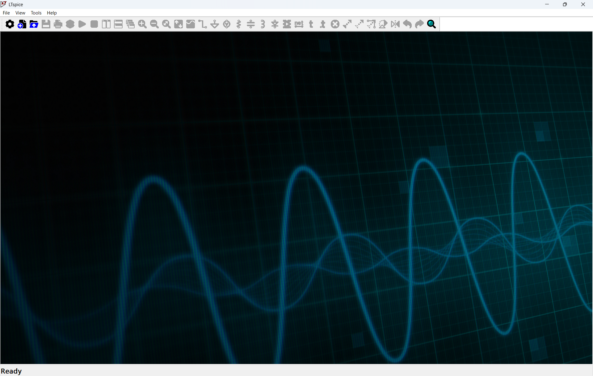

**図: LTspice起動後の画面**

1. LTspiceを起動します（インストール手順は01_LTspiceインストールガイドを参照）
2. 起動すると上記のような画面が表示されます

### ステップ2: 新しい回路図を開く

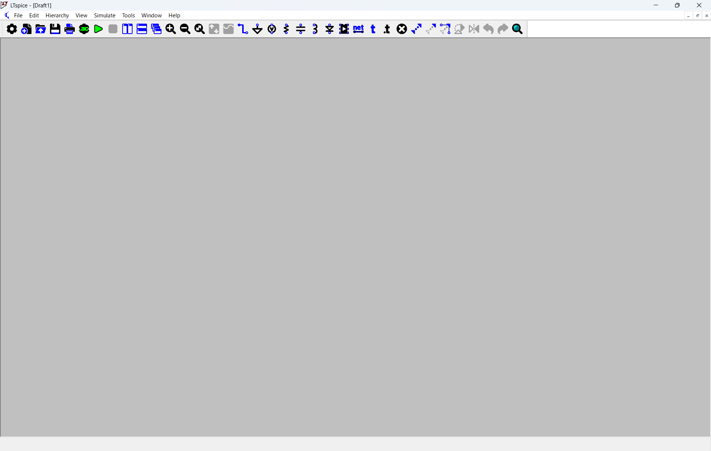

**図: LTspice新規回路図作成画面**

1. **File** → **New Schematic** をクリック
2. または、ツールバーの **新規ファイルアイコン** をクリック
3. 空白の回路図エディタが開きます

💡 **TIPS**: ショートカットキー **Ctrl + N** (Windowsキー) または **⌘N** (Macキー) でも新規回路図を作成できます

---

## 4️⃣ 部品の配置

### ステップ1: 部品配置モードに入る

部品を配置する方法は3つあります：

**方法1: クイックアクセスツールバーから（推奨）**


**図: よく使う部品の配置ボタン**

画面上部のツールバーには、よく使う部品の配置ボタンが並んでいます：

| ショートカット | 部品 | 説明 |
|---------------|------|------|
| **R** | **抵抗 (Resistor)** | 抵抗素子を配置 |
| **C** | **コンデンサ (Capacitor)** | コンデンサ素子を配置 |
| **L** | **インダクタ (Inductor)** | インダクタ素子を配置 |
| **G** | **GND (Ground)** | グラウンド記号を配置 |
| **D** | **ダイオード (Diode)** | ダイオード素子を配置 |
| **V** | **電圧源 (Voltage)** | 電圧源を配置 |

これらのショートカットキーを押すと、該当する部品が直接配置モードになり、よく使うRLC素子やダイオードを素早く配置できます。

💡 **TIPS**: ツールバーのアイコンをクリックする代わりに、キーボードの **R**, **C**, **L**, **D**, **G**, **V** を押すだけで配置できます！

**方法2: 部品検索ダイアログから**
- ツールバーの **部品アイコン** をクリック
- または **P** キーを押す

**方法3: ショートカットキー**
- **P** キーを押す（部品検索ダイアログが開きます）
- 以前のバージョンの **F2** キーは使用できなくなりました

### ステップ2: スイッチ (SW) を配置

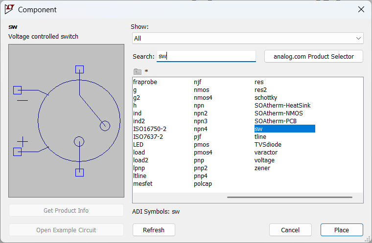

**図: Component選択ダイアログ**

1. **Component** ダイアログが表示されます
2. **Search:** 欄に `sw` と入力
3. リストから **sw** を選択（Voltage controlled switch）
4. **Place** ボタンをクリック
5. 回路図上の配置したい場所でクリック

💡 **TIPS**:
- 部品を回転: **Ctrl + R** (Windowsキー) または **⌘R** (Macキー)
- 部品を反転: **Ctrl + E** (Windowsキー) または **⌘E** (Macキー)
- 配置をキャンセル: **ESC** または 右クリック

### ステップ3: その他の部品を配置

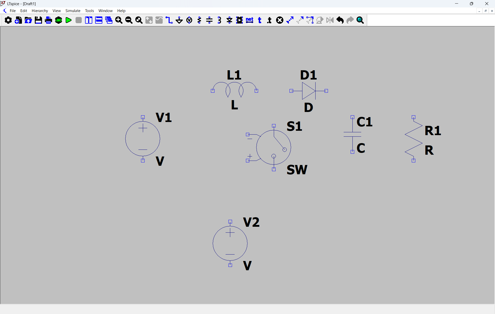

**図: 配置された部品一覧**

同様の手順で以下の部品を配置します：

| 部品名 | ショートカット | 検索キーワード | 個数 |
|--------|---------------|----------------|------|
| **電圧源** | **V** | `voltage` | 2個 (V1, V2) |
| **インダクタ** | **L** | `ind` | 1個 (L1) |
| **ダイオード** | **D** | `diode` | 1個 (D1) |
| **コンデンサ** | **C** | `cap` | 1個 (C1) |
| **抵抗** | **R** | `res` | 3個 (R1, R2, R3) |
| **GND** | **G** | `gnd` | 1個 |
| **スイッチ** | **P**キー後検索 | `sw` | 1個 (S1) |

**配置のポイント:**

```
左側: 入力電源 (V1)
中央上部: インダクタ (L1)、スイッチ (S1)、ダイオード (D1)
右側: 出力部（コンデンサC1、負荷抵抗R1）
中央下部: 制御電源 (V2)、ゲート抵抗 (R2)、プルダウン抵抗 (R3)
左下: GND
```

### ステップ3-1: ゲート駆動回路の追加（重要）

実際の回路では、MOSFETのゲート駆動に以下の2つの抵抗を追加することが推奨されます：

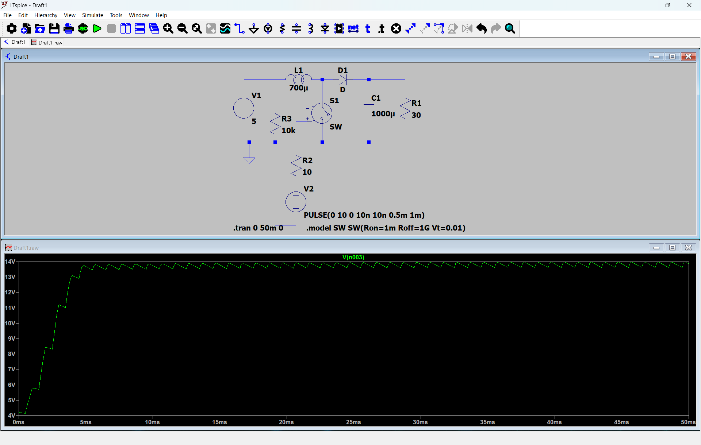

**図: ゲート抵抗とプルダウン抵抗を追加した回路**

**追加する抵抗の役割:**

| 抵抗 | 値 | 接続位置 | 役割 |
|------|-----|---------|------|
| **R2** | 10Ω | PWM信号源とMOSFETゲート間 | ゲート電流制限・発振防止 |
| **R3** | 10kΩ | MOSFETゲート-ソース間 | プルダウン抵抗・誤動作防止 |

**R2（ゲート抵抗）の役割:**
- ゲート充放電電流を制限
- 高周波発振を防止
- スイッチング速度の調整
- ゲート駆動回路の保護

**R3（プルダウン抵抗）の役割:**
- PWM信号がOFF時にゲートを確実にGNDに引き下げ
- ゲート浮遊による誤動作を防止
- ノイズ耐性の向上
- MOSFETの確実なOFF状態を保証

💡 **重要**: 実際の回路設計では、これらの抵抗を省略するとMOSFETが誤動作したり、発振したりする可能性があります。シミュレーションでも実回路に近い動作を確認するため、これらの抵抗を追加することを推奨します。

---

## 5️⃣ 配線の接続

### ステップ1: 配線モードに入る

配線する方法は2つあります：

**方法1: ショートカットキー（推奨）**
- **W** キーを押す（Wire = 配線）

**方法2: ツールバーから**
- ツールバーの **ワイヤーアイコン** をクリック

💡 **TIPS**: 以前のバージョンの **F3** キーは使用できなくなりました。**W** キーが新しいショートカットです。

### ステップ2: 部品を配線で接続


**図: 配線で接続された回路**

**配線の手順:**

1. **配線モード**に入る（Wキー）
2. 接続開始点（部品の端子）をクリック
3. 接続終了点をクリック
4. 自動的に直角配線されます

**回路の接続:**

```
[入力ループ]
V1(+) → L1左端
L1右端 → S1上端、D1アノード（左側）
S1下端 → GND
V1(-) → GND

[出力ループ]
D1カソード（右側） → C1(+)、R1上端
C1(-) → GND
R1下端 → GND

[ゲート駆動回路]
V2(+) → R2左端
R2右端 → S1ゲート、R3上端
R3下端 → GND
V2(-) → GND
```

💡 **TIPS**:
- 配線をキャンセル: **ESC** または 右クリック
- 配線を削除: **Ctrl + X** または **⌘X** (削除モード) で配線をクリック
  - 以前のバージョンの **F5** キーは使用できなくなりました
- 配線が部品端子に接続されると青い四角が表示されます

### 接続確認のポイント

✅ **正しく接続されている状態:**
- 部品端子と配線の接続点に **青い四角（ノード）** が表示
- 配線が途切れていない

❌ **接続されていない状態:**
- 配線が部品端子に届いていない
- 配線同士が交差しているだけ（接続ドットがない）

---

## 6️⃣ 部品値の設定

配置した部品に具体的な値を設定します。

### ステップ1: 入力電源 V1 の設定


**図: Voltage Source - V1 設定画面**

1. **V1** を右クリック
2. **DC value[V]:** に `5` と入力
3. **Series Resistance[Ω]:** は空欄のまま
4. **OK** をクリック

### ステップ2: 制御電源 V2 の設定（パルス波形）


**図: Voltage Source - V2 設定画面**

1. **V2** を右クリック
2. 右下の **Advanced** ボタンをクリック
3. **Independent Voltage Source** ダイアログが表示されます

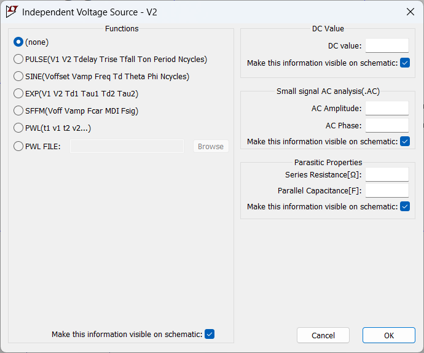

**図: Functions選択**

4. **Functions** セクションで **PULSE** を選択

💡 **TIPS**: **Advanced** ボタンをクリックすると、PULSE、SINE、EXPなどの詳細な関数設定ができるようになります

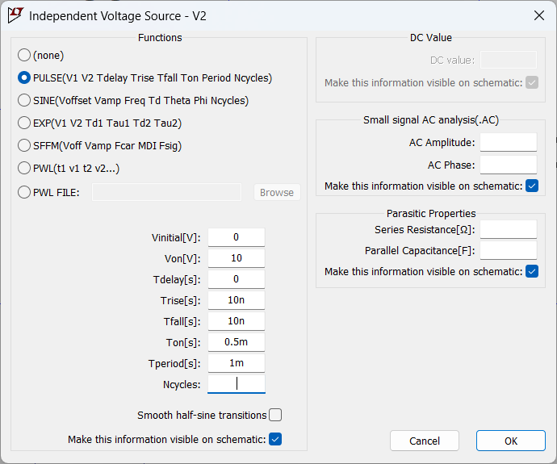

**図: PULSE関数のパラメータ設定**

5. 以下のパラメータを設定:

| パラメータ | 値 | 説明 |
|-----------|-----|------|
| **Vinitial[V]** | 0 | 初期電圧（LOW） |
| **Von[V]** | 10 | パルス電圧（HIGH） |
| **Tdelay[s]** | 0 | 遅延時間 |
| **Trise[s]** | 10n | 立ち上がり時間（10ns） |
| **Tfall[s]** | 10n | 立ち下がり時間（10ns） |
| **Ton[s]** | 0.5m | ONパルス幅（0.5ms） |
| **Tperiod[s]** | 1m | パルス周期（1ms = 1kHz） |
| **Ncycles** | 空欄 | サイクル数（無限） |

6. **OK** をクリック

💡 **PULSE関数のパラメータ:**
```
PULSE(Vinitial Von Tdelay Trise Tfall Ton Tperiod Ncycles)

デューティ比 = Ton / Tperiod = 0.5ms / 1ms = 50%
周波数 = 1 / Tperiod = 1kHz
```

### ステップ3: その他の部品値を設定

同様に、各部品をクリックして値を設定します：

| 部品 | 値 | 設定方法 |
|------|-----|---------|
| **L1** | 700µ | インダクタをクリック → Inductance[H]: `700u` |
| **D1** | D | ダイオードは標準モデル（変更不要） |
| **C1** | 1000µ | コンデンサをクリック → Capacitance[F]: `1000u` |
| **R1** | 30 | 負荷抵抗をクリック → Resistance[Ω]: `30` |
| **R2** | 10 | ゲート抵抗をクリック → Resistance[Ω]: `10` |
| **R3** | 10k | プルダウン抵抗をクリック → Resistance[Ω]: `10k` |

💡 **単位の書き方:**
- `µ` (マイクロ) = `u`
- `m` (ミリ) = `m`
- `k` (キロ) = `k`
- `M` (メガ) = `Meg`

---

## 7️⃣ シミュレーション設定

### ステップ1: トランジェント解析の設定


**図: Configure Analysis - Transient**

1. メニューバー **Simulate** → **Edit Simulation Cmd** をクリック
2. **Transient** タブを選択
3. **Stop time:** に `50m` と入力（50ミリ秒）
4. **Time to start saving data:** に `0` と入力
5. **OK** をクリック

💡 **TIPS**:
- Stop time = シミュレーション終了時間
- 50ms = 50サイクル分のシミュレーション（周期1ms × 50）

### ステップ2: シミュレーションコマンドを配置

**Configure Analysis** で **OK** を押すと、カーソルに `.tran 0 50m 0` というテキストが付いてきます。

1. 回路図の空いている場所（左下など）をクリック
2. SPICEディレクティブが配置されます

---

## 8️⃣ トラブルシューティング

### エラー: "Undefined model 'sw'"

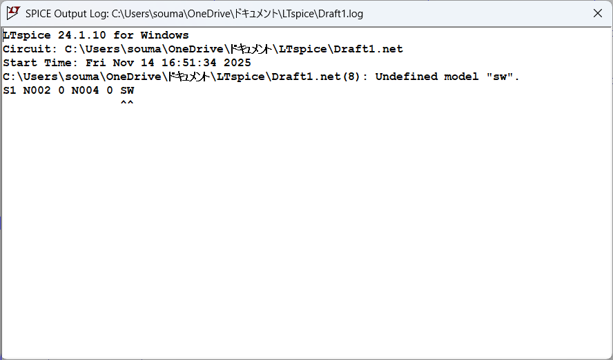

**図: SPICE Error Log**

シミュレーションを実行すると、以下のエラーが表示されることがあります：

```
Undefined model "sw"
S1 N002 0 N004 0 SW
```

**原因:**
スイッチ部品（SW）にはモデル定義が必要ですが、まだ定義されていません。

**解決方法:** SPICEディレクティブでスイッチモデルを定義します。

### ステップ1: SPICEディレクティブの追加


**図: Edit Text on the Schematic（SPICEディレクティブ入力）**

1. メニューバー **Edit** → **SPICE Directive** をクリック（ショートカット: `S`）
2. テキスト入力欄に以下を入力:

```
.model SW SW(Ron=1m Roff=1G Vt=0.01)
```

3. **SPICE directive** を選択
4. **OK** をクリック
5. 回路図上の適当な場所（例: .tranコマンドの下）をクリックして配置

**モデルパラメータの説明:**

| パラメータ | 値 | 説明 |
|-----------|-----|------|
| **Ron** | 1m | ON抵抗（1mΩ = 0.001Ω） |
| **Roff** | 1G | OFF抵抗（1GΩ = 10億Ω） |
| **Vt** | 0.01 | しきい値電圧（0.01V） |

💡 **TIPS**:
- Ron: スイッチON時の抵抗（小さいほど理想的）
- Roff: スイッチOFF時の抵抗（大きいほど理想的）
- Vt: 制御電圧がこの値を超えるとON

---

## 9️⃣ シミュレーション実行と結果

### ステップ1: シミュレーションの実行


**図: Transient解析設定（Stop time: 50ms）**

1. 回路図上の `.tran 0 50m 0` をクリックして、設定を確認
2. ツールバーの **Run（再生ボタン）** をクリック、または **Ctrl + R** (Windowsキー) / **⌘R** (Macキー) を押す

### ステップ2: 最終的な回路図

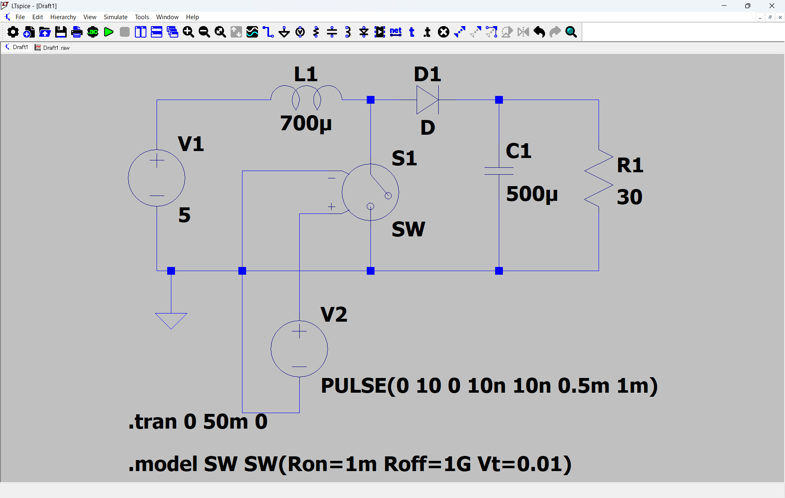

**図: 完成した回路図（部品値とSPICEディレクティブ表示）**

最終的な回路には以下が含まれています：

- ✅ すべての部品値が設定されている
  - V1 = 5V
  - L1 = 700µH
  - C1 = 500µF
  - R1 = 30Ω
- ✅ V2にPULSE関数が設定されている
  - `PULSE(0 10 0 10n 10n 0.5m 1m)`
- ✅ SPICEディレクティブが2つ配置されている
  - `.tran 0 50m 0` （トランジェント解析）
  - `.model SW SW(Ron=1m Roff=1G Vt=0.01)` （スイッチモデル）

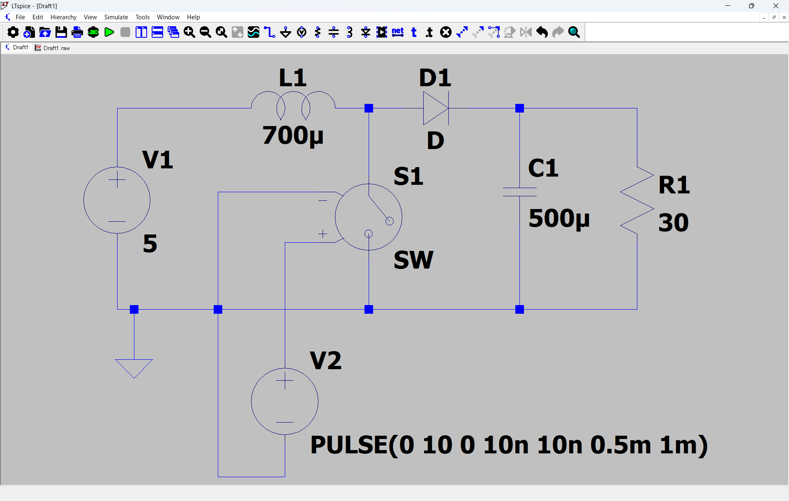

**図: 簡略化表示の回路図**

### ステップ3: 波形の確認

シミュレーションが完了すると、波形ビューアが自動的に開きます。

**出力電圧を確認する:**

1. 波形ビューアのカーソルが **プローブモード** になっています
2. 回路図上の **C1とR1の接続点**（出力電圧ノード）をクリック
3. 出力電圧の波形が表示されます

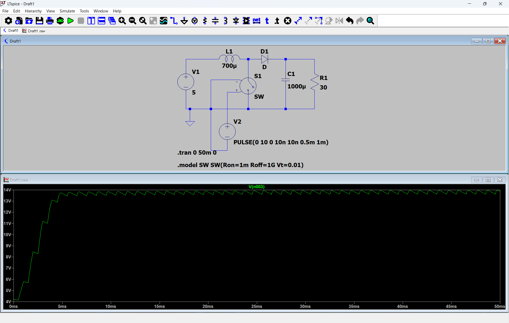

**図: シミュレーション結果（出力電圧波形）**

### 結果の読み方

**波形の特徴:**

| 項目 | 値 | 説明 |
|------|-----|------|
| **入力電圧** | 5V | V1の設定値 |
| **最終出力電圧** | 約13-14V | 昇圧後の電圧 |
| **立ち上がり時間** | 約10ms | 初期充電時間 |
| **リップル** | わずか | 出力電圧の変動 |

**動作確認:**

✅ **正常動作:**
- 出力電圧が入力電圧（5V）より高い（約14V）
- 時間とともに安定した電圧に収束
- 昇圧動作が確認できる

❌ **異常動作の例:**
- 出力電圧が0Vのまま → 配線ミスの可能性
- 出力電圧が極端に高い/低い → 部品値の設定ミス
- 波形が発散する → モデルパラメータの問題

### より詳しい波形観測

**他の信号を確認する:**

| 観測点 | 確認内容 |
|--------|---------|
| **V2** | PWM制御信号（0V ⇔ 10V、1kHz、デューティ50%） |
| **L1の電流** | インダクタに流れる電流波形 |
| **S1の電圧** | スイッチの両端電圧 |
| **D1の電流** | ダイオードに流れる電流 |

**電流を表示する方法:**
1. `Alt` キーを押しながら部品をクリック
2. その部品に流れる電流が表示されます

---

## 🔟 まとめ

### この章で学んだこと

✅ **LTspiceの基本操作:**
- 新規回路図の作成
- 部品の配置（Pキー または R/C/L/D/G/Vキー）
- 配線の接続（Wキー）
- 部品値の編集

✅ **シミュレーション設定:**
- トランジェント解析の設定
- SPICEディレクティブの使用
- モデル定義の方法

✅ **実践的な回路設計:**
- 昇圧回路（ブーストコンバータ）の作成
- PWM制御信号の生成（PULSE関数）
- シミュレーション結果の確認

### 回路設計のポイント

**昇圧回路の設計パラメータ:**

```
出力電圧 Vout ≈ Vin / (1 - D)

D: デューティ比 = Ton / Tperiod = 0.5 (50%)
Vin: 入力電圧 = 5V
Vout ≈ 5V / (1 - 0.5) = 10V (理論値)

実際の出力: 約13-14V
（ダイオード順方向電圧降下や損失を考慮すると理論値より高くなることがあります）
```

**インダクタ値の選定:**
```
L = (Vin × D × Tperiod) / (2 × ΔIL)

D: デューティ比 = 0.5
Tperiod: 周期 = 1ms
ΔIL: 許容リップル電流

L = 700µHを選定
```

**出力コンデンサの選定:**
```
C = (Iout × D × Tperiod) / ΔVout

Iout: 出力電流
ΔVout: 許容リップル電圧

C = 500µFを選定（リップルを小さくするため）
```

### トラブルシューティング まとめ

| 問題 | 原因 | 解決方法 |
|------|------|---------|
| "Undefined model" エラー | モデル未定義 | `.model` ディレクティブを追加 |
| 波形が表示されない | ノードをクリックしていない | 回路図上の観測点をクリック |
| 出力電圧が0V | 配線ミス | 接続を確認（青い四角があるか） |
| シミュレーションが遅い | Stop timeが長すぎる | Stop timeを短く設定（10m程度） |

---

## 1️⃣1️⃣ 演習課題：実際の部品を使ってシミュレーション

### 課題1: 実際に用意している部品の値でシミュレーション

これまで学習用の値（L1=700µH、C1=1000µF）でシミュレーションを行いましたが、実際に購入した部品の仕様に合わせてシミュレーションを行ってみましょう。

#### 実際に用意している部品リスト

| 部品 | 型番 | 仕様 |
|------|------|------|
| **インダクタ** | TCV-470M-9A-8026 | 47µH ±20%、定格電流7A、DCR≤40mΩ |
| **インダクタ** | TCV-101M-9A-8026 | 100µH ±20%、定格電流5A |
| **インダクタ** | TCV-201M-9A-8026 | 200µH ±20%、定格電流4A |
| **インダクタ** | TCV-331M-9A-8026 | 330µH ±20%、定格電流3A |
| **インダクタ** | TCV-471M-9A-8026 | 470µH ±20%、定格電流3A |
| **コンデンサ** | RVT1H1R0M0405 | 50V 1µF、サイズφ4×5mm |
| **コンデンサ** | RVT1H100M0505 | 50V 10µF、サイズφ5×5mm |
| **コンデンサ** | RVT1H220M0505 | 50V 22µF、サイズφ5×5mm |
| **コンデンサ** | RVT1H101M0607 | 50V 100µF、サイズφ6.3×7mm |
| **コンデンサ** | RVT1H102M1220 | 50V 1000µF、サイズφ12.5×20mm |
| **ダイオード** | MA10EB045 | ショットキー、45V 10A、Vf=0.65V |
| **ダイオード** | SR54F | ショットキー、40V 5A、Vf=0.6V |

**参照**: `251116_部品リスト_KiCadシンボルフットプリント対応表.md`

#### 課題内容

**問1**: 上記の部品リストから、以下のインダクタ値に変更してシミュレーションを実行し、出力電圧がどのように変化するか確認してください。

- L1 = 47µH (TCV-470M-9A-8026)
- L1 = 100µH (TCV-101M-9A-8026)
- L1 = 470µH (TCV-471M-9A-8026)

**手順:**
1. L1を右クリック → Inductance[H]の値を変更
2. シミュレーションを実行（F9キー）
3. 出力電圧（V(003)）を確認
4. 結果を表にまとめる

**結果記録表:**

| インダクタンス | 型番 | 出力電圧 | リップル | メモ |
|--------------|------|---------|---------|------|
| 47µH | TCV-470M-9A-8026 |  |  |  |
| 100µH | TCV-101M-9A-8026 |  |  |  |
| 470µH | TCV-471M-9A-8026 |  |  |  |
| 700µH | (学習用) |  |  |  |

**問2**: 出力コンデンサの値を変更して、出力リップル電圧への影響を確認してください。

- C1 = 100µF (RVT1H101M0607)
- C1 = 1000µF (RVT1H102M1220)

**確認ポイント:**
- 出力電圧波形のリップル（変動）の大きさ
- 立ち上がり時間の違い
- どちらが実用的か考察

---

### 課題2: スイッチング周波数を100kHzに変更する

現在の回路はPWM周波数が1kHzですが、実際のDC-DCコンバータでは通常50kHz〜数百kHzで動作します。スイッチング周波数を100kHzに変更してみましょう。

#### 課題内容

**問3**: V2のPULSE設定を変更して、スイッチング周波数を100kHzにしてください。

**ヒント:**
```
周波数 = 1 / 周期
100kHz = 1 / 周期

周期 Tperiod = ?

デューティ比50%を維持するには:
Ton = Tperiod × 0.5 = ?
```

**計算:**
- 周波数100kHzの周期 Tperiod = _________ (s)
- デューティ比50%の場合 Ton = _________ (s)

**変更するパラメータ:**

| パラメータ | 現在の値 (1kHz) | 新しい値 (100kHz) |
|-----------|----------------|------------------|
| **Tperiod[s]** | 1m (1ms) |  |
| **Ton[s]** | 0.5m (0.5ms) |  |

**確認事項:**
1. V2を右クリック → Advanced → PULSE設定を変更
2. Tperiod と Ton の値を計算して入力
3. シミュレーションを実行
4. 出力電圧とリップルを確認

---

**作成者**: Claude Code
**プロジェクト**: karihai26_mirror
**最終更新**: 2025-11-14

🤖 Generated with [Claude Code](https://claude.com/claude-code)

Co-Authored-By: Claude <noreply@anthropic.com>
